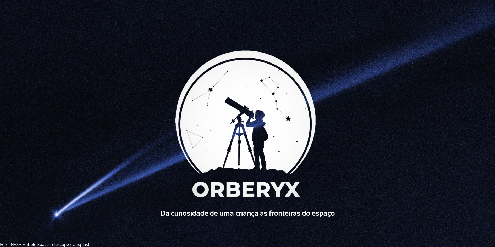
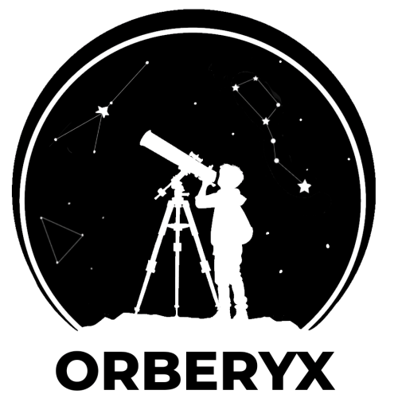

# 🏢 Sobre nós

A **Orberyx** é uma startup acadêmica criada para o projeto da disciplina de **Programação Orientada a Objetos**.

Nosso objetivo é desenvolver soluções utilizando programação, dados e tecnologias modernas, com foco em aplicações relacionadas à **ciência e ao espaço**.

## 🎯 Missão

Desenvolver soluções tecnológicas que integrem programação, dados e ciência de forma acessível e funcional.

## 👁️ Visão

Aplicar os conhecimentos adquiridos durante o curso no desenvolvimento de projetos organizados, colaborativos e capazes de solucionar problemas reais.

## 💎 Valores

- 🤝 **Colaboração** — desenvolvimento realizado de forma conjunta e organizada;
- 💡 **Inovação** — busca por soluções criativas e tecnologias adequadas;
- 📚 **Aprendizado** — evolução contínua através da prática e da pesquisa;
- 🧩 **Organização** — código, documentação e responsabilidades bem estruturados;
- 🚀 **Tecnologia** — aplicação prática da programação na construção de soluções.

 

---

## 👥 Nossa Equipe

<table width="100%">
  <thead>
    <tr>
      <th align="center">Membro</th>
      <th align="left">Área</th>
      <th align="left">Responsabilidade</th>
    </tr>
  </thead>
  <tbody>

  <tr>
    <td align="center" width="140">
      <a href="https://github.com/Adriel12179">
       
      <b>Adriel</b>
    </td>
    <td valign="middle">Filtros e processamento de dados</td>
    <td valign="middle">
      Classificação, organização e filtragem dos asteroides apresentados pelo sistema.
    </td>
  </tr>

  <tr>
    <td align="center" width="140">
      <a href="https://github.com/Mayrllon14">
       
      <b>Mayrllon</b>
    </td>
    <td valign="middle">Autenticação e favoritos</td>
    <td valign="middle">
      Sistema de login, autenticação dos usuários e gerenciamento dos asteroides adicionados aos favoritos.
    </td>
  </tr>

  <tr>
    <td align="center" width="140">
      <a href="https://github.com/niveamaria11-dev">
       
      <b>Nívea</b>
    </td>
    <td valign="middle">Interface e JavaFX</td>
    <td valign="middle">
      Desenvolvimento da interface gráfica utilizando JavaFX, FXML e CSS.
    </td>
  </tr>

  <tr>
    <td align="center" width="140">
      <a href="https://github.com/renancardoso09-maker">
       
      <b>Renan</b>
    </td>
    <td valign="middle">Banco de Dados</td>
    <td valign="middle">
      Modelagem e estrutura do banco de dados, persistência, JDBC e implementação da camada DAO.
    </td>
  </tr>

  <tr>
    <td align="center" width="140">
      <a href="https://github.com/wndelix">
       
      <b>Wendel</b>
    </td>
    <td valign="middle">API NASA</td>
    <td valign="middle">
      Comunicação com a NASA API, requisições HTTP, processamento das respostas JSON e integração dos dados externos com o sistema.
    </td>
  </tr>

  </tbody>
</table>

 

---

## 🚀 Projetos

### ☄️ AstroWatch

O **AstroWatch** é uma aplicação desktop para consulta e acompanhamento de asteroides próximos à Terra utilizando dados fornecidos pela **NASA**.

O projeto integra informações obtidas através da **NASA API** com persistência em banco de dados e uma interface gráfica desenvolvida em **JavaFX**.

> 🚧 **Status:** Integração de filtro de busca.

### ✨ Principais funcionalidades

- ☄️ Consulta de asteroides utilizando dados da NASA API;
- 🔎 Pesquisa e filtragem dos objetos apresentados;
- ⚠️ Identificação de asteroides potencialmente perigosos;
- 🔐 Sistema de autenticação de usuários;
- ⭐ Gerenciamento de asteroides favoritos;
- 🗄️ Persistência de dados em banco de dados;
- 🌐 Integração com informações oficiais fornecidas pela NASA.

---

 

<picture>
  <source media="(prefers-color-scheme: dark)" srcset="./assets/orberyx-white.svg">
  <source media="(prefers-color-scheme: light)" srcset="./assets/orberyx-black.svg">
  
</picture>

 

<i>"Tudo começa com um olhar. Antes do código, das equações e da engenharia, existe a curiosidade pura de quem olha para o céu e se pergunta o que há além. A Orberyx nasceu para transformar esse encantamento em tecnologia. Construímos pontes de código entre os dados do cosmos e a tela do usuário, provando que o conhecimento do universo não pertence apenas aos laboratórios, mas a qualquer mente curiosa com um telescópio, ou um computador."</i>

<i>Equipe Orberyx - 2026</i>

